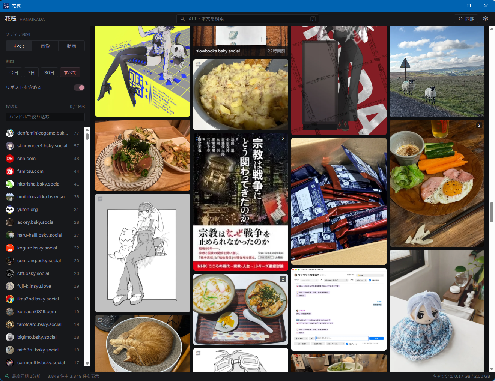
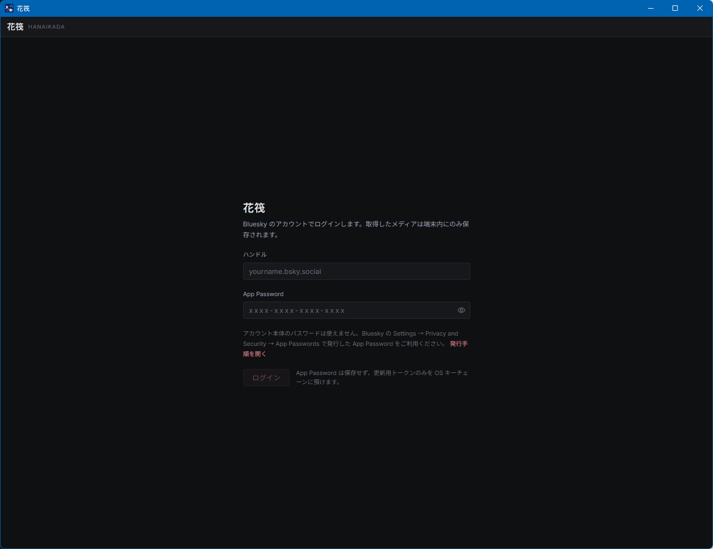
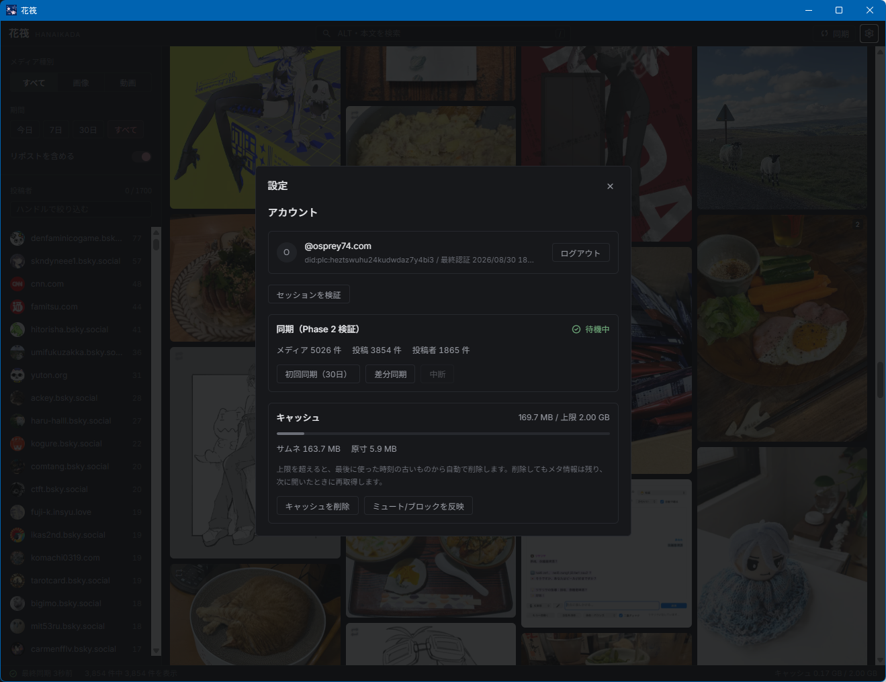

# 花筏 (Hanaikada)

**Bluesky のフォロー中アカウントが投稿・リポストした画像と動画だけを、ローカルに溜めて高密度なグリッドで眺める、Windows / macOS 向けデスクトップアプリ。**

Bluesky の通常タイムラインは時系列のテキスト主体で、画像を「見る」用途には密度が低いものです。花筏は、フォロー中アカウントのメディア投稿だけを端末内に蓄積し、高密度なグリッドで閲覧・検索できるようにします。

[English](./README.md) ・ [操作マニュアル](./docs/MANUAL.ja.md)

> **閲覧専用アプリです。** 投稿・いいね・リポスト・フォローなどの書き込み操作は一切行いません。取得したメディアは端末内にのみ保存されます。

---

## スクリーンショット



| ログイン | 設定 |
|---|---|
|  |  |

---

## 主な機能

- **メディアだけのグリッド** — 画像・動画の投稿だけを新しい順に高密度表示（仮想化 Masonry）。複数枚はまとめて 1 タイル（枚数バッジ）、動画は再生アイコン、リポストは控えめな印。
- **ローカル蓄積とオフライン閲覧** — SQLite に永続化し、サムネはディスクにキャッシュ。オフラインでもキャッシュ済みメディアを閲覧できます。
- **絞り込み** — 投稿者（複数選択・ハンドル検索）／種別（画像・動画）／期間（今日・7日・30日・すべて・カスタム）／リポストの有無／ALT・本文の全文検索。
- **ライトボックス** — 全画面表示、同一投稿内の複数枚送り、動画（HLS）のアプリ内再生、元投稿を既定ブラウザで開く。
- **モデレーション** — Bluesky のラベラー設定（`getPreferences`）を反映し、警告系ラベル付きメディアを既定でブラー（クリックで解除）。ミュート／ブロックを突き合わせてローカルの過去分も非表示化。
- **キャッシュ管理** — ディスクキャッシュは既定上限 2GB。超過時は古いものから自動削除（LRU）。設定画面に使用量表示と手動クリア。

## プライバシーと安全性

- **書き込み API を一切実装していません**（閲覧専用）。
- **App Password は保存しません。** 更新用トークン（refreshJwt）のみを OS のキーチェーン（Windows 資格情報マネージャー / macOS キーチェーン）に保存します。
- API・CDN へのアクセスはすべて Rust 側に閉じており、フロントエンドから外部へ直接アクセスしません。
- ログインには Bluesky の **App Password**（Settings → Privacy and Security → App Passwords で発行）を使います。アカウント本体のパスワードは使えません。

## 技術スタック

| 層 | 採用技術 |
|---|---|
| シェル | Tauri v2 |
| フロントエンド | React + TypeScript + Vite |
| バックエンド | Rust |
| DB | SQLite（rusqlite, FTS5） |
| 秘匿情報 | OS キーチェーン（keyring crate） |
| 仮想化リスト | react-virtuoso |
| 動画再生 | hls.js |
| 対象 OS | Windows / macOS |

## インストール

リリースページのインストーラをご利用ください。

- **Windows**: `Hanaikada_x.y.z_x64-setup.exe`（NSIS）または `Hanaikada_x.y.z_x64_en-US.msi`（MSI）
- **macOS**: `Hanaikada_x.y.z_universal.dmg`

> 現在の配布物はコード署名を行っていないため、初回起動時に OS の警告が表示される場合があります。Windows では「詳細情報 → 実行」、macOS では「右クリック → 開く」で起動できます。

## 使い方（かんたん）

1. Bluesky の **handle** と **App Password** でログインします。
2. 「初回同期をはじめる」で、フォロー中のメディア投稿を取り込みます。
3. 以降は「同期」ボタン（またはキー `r`）で新着だけを取り込みます。
4. タイルをクリックで拡大、左サイドバーで絞り込み、上部の検索で ALT・本文を検索できます。

詳しい操作は [操作マニュアル](./docs/MANUAL.ja.md) を参照してください。

## キーボードショートカット

ショートカットは **Windows / macOS 共通**（すべて単一キー、修飾キー不要）です。

**グリッド**

| キー | 動作 |
|---|---|
| `/` | 検索フィールドにフォーカス |
| `Esc` | 検索解除／絞り込み解除／設定を閉じる |
| `r` | 手動で同期する |

**ライトボックス（拡大表示中）**

| キー | 動作 |
|---|---|
| `←` / `→` | 同一投稿内の前後のメディアへ |
| `o` | 元投稿を既定ブラウザで開く |
| `Space` | 動画の再生／一時停止 |
| `Esc` | ビューアを閉じる |

## 開発

```bash
npm install          # 依存をインストール
npm run tauri dev    # 開発ビルドで起動
npm run tauri build  # リリースビルド＋インストーラ生成
```

- 前提: Node.js、Rust ツールチェーン、各 OS のビルドツール（Windows: MSVC / Visual Studio Build Tools、macOS: Xcode Command Line Tools）。
- 設計資料は `DESIGN.md`、実装フェーズと受け入れ条件は `HANDOFF.md`、検証記録は `learnings.md` を参照。

## 姉妹アプリ

同じ開発者による Bluesky クライアント **Kazahana（風花）** があります。Kazahana が 1 カラムのテキスト主体なのに対し、花筏は横幅を使い切るグリッド主体の「見る」ための姉妹アプリです。

## ライセンス

[MIT](./LICENSE)
